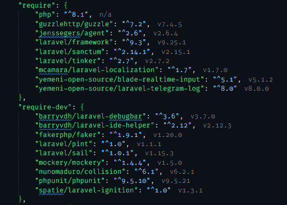
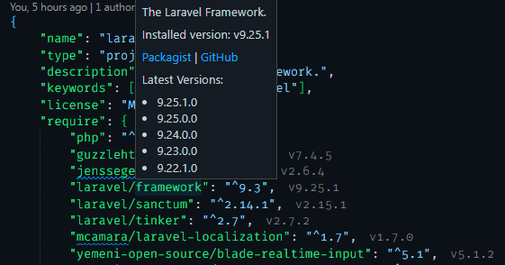

# VSCode Composer Intelephense

This [Visual Studio Code](https://code.visualstudio.com/) plugin offers Intelephense for the PHP dependency manager [Composer](https://getcomposer.org/).

Currently installed Composer package hint


Real autocomplete


Hover a package to get more info


## Features

- Autocomplete dependency names based on [Packagist](https://packagist.org/)
- Display currently installed package version next to package entry (on document save)
- Hover over package names to get insights about the installed package
- Hover over package names to get the latest available package versions

## Planned Features

- Command to install / update dependencies inline

## Requirements

You should have [Composer](https://getcomposer.org/) installed. But the plugin is actually not relying on it.

## Installation

- Open VS Code and click on Extensions Icon in the Activity Bar.
- Type:

    ```bat
    muath-ye.vscode-composer-Intelephense
    ```

- Install the Extension Pack.

## Credit

This is a fork from [vscode-composer-intellisense](https://github.com/kainiklas/vscode-composer-intellisense)
